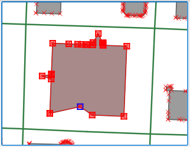
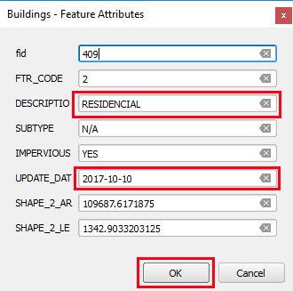

Now, that we have the layer under GeoGig versioning, we can safely edit it,
knowing that we can always go back to the layer's original state when imported
it. The layer editing is done, as usual, using QGIS digitizing tools and
attributes editing. We will start by editing a geometry.

* In the **Layers Panel**, right-click the *Buildings* layer and select
  **Toggle Editing** to make the layer editable.
* In the **Digitizing toolbar**, click the node tool button to enable it. Use the tool to
  change the geometry of the feature in the center of the map canvas. For example,
  remove some vertices.

    

* From the **Attributes toolbar**, click the **Identify Feature** button to enable it.
* Then, click the edited feature.
* In the **Buildings - Feature Attributes** dialog, change any of the feature's
  attributes. For example, change the **DESCRIPTIO** field from `COMMERCIAL` to
  `RESIDENTIAL`, and set the **UPDATE_DAT** field to today's date. Click **OK**.

    

* In the **Digitizing toolbar**, click the **Save Edits** button, to save the changes you made.

Once you are done, click **Next step**

