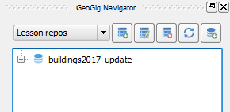
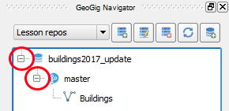
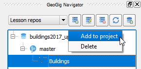

For this lesson, you will notice that there is already a repository
called *buildings2017_update* in the GeoGig server.

For this lesson, let's imagine that this is a GeoGig
server you share with other coworkers and that the
*buildings2017_update* repository holds versioned information about
buildings that you and your colleagues were tasked to update.

You will notice that the current QGIS project has no *Buildings* layer
yet. That's because we will need to load it from the repository. This is
what we will do in this step.

* In the **GeoGig Navigator**, expand the *buildings2017_update*
  repository and its *master* branch contents. You will see a *Buildings*
  layer under the branch.

    

* Right-click the *Buildings* layer and select **Add to project**

    

The *Buildings* layer should load into the current project.

Click **Next step** once you are done.